# AI-Project
This Repository is dedicated to my AI course project

#Game Description

Quoridor is a 2-player strategy board game played on a 9×9 grid. Each player starts on opposite sides and races to reach the other side's baseline. On your turn you can either move your pawn one square in any direction orthogonally, or place one of your fences to block your opponent's path. You have 10 fences each, if two pawns face each other the player who's turn is to play can jump behind the other player's pawn, if there is no wall behind that pawn, if there is a wall, then the player can move diagonally in direction of that other pawn, given that there are no extra walls cutting that step. You can never completely seal off your opponent's path to the goal. First player to reach the opposite baseline wins.

#Screenshots

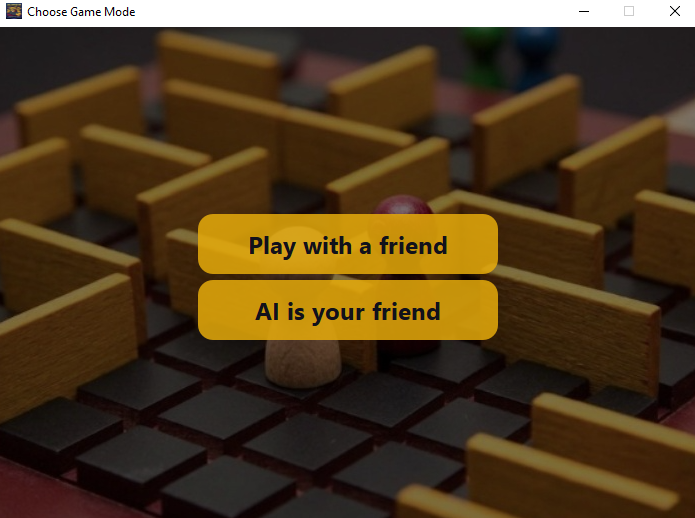
Play Against your friend mode:
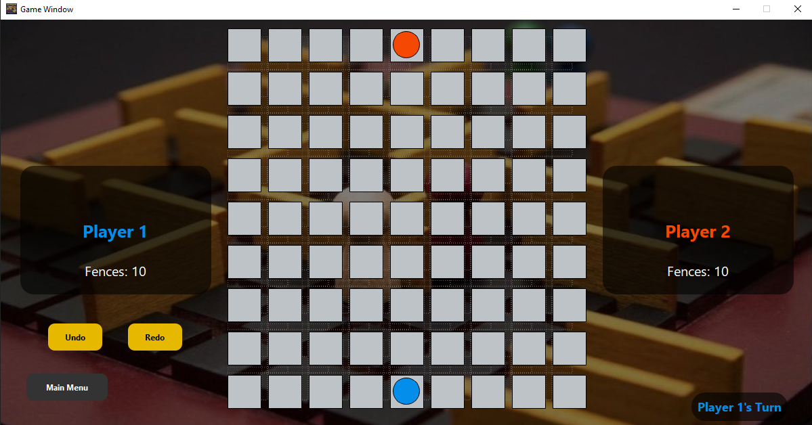
When you press on your pawn in your turn, you can see your valid moves
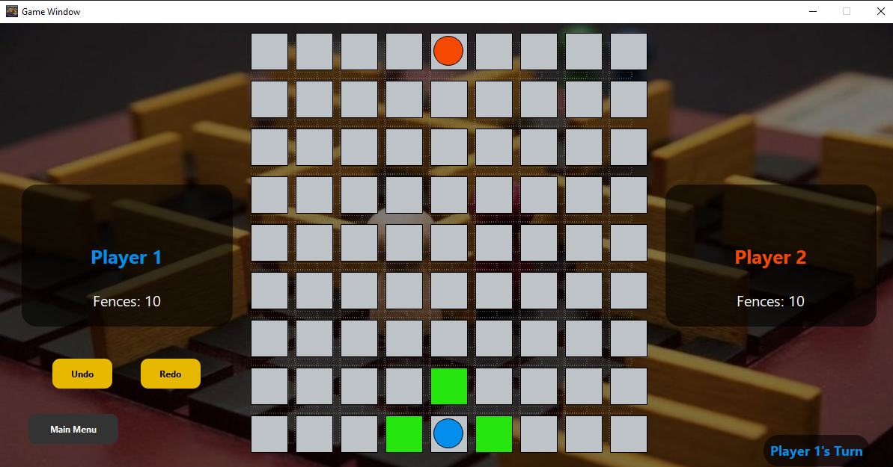
Jumping behind the pawn
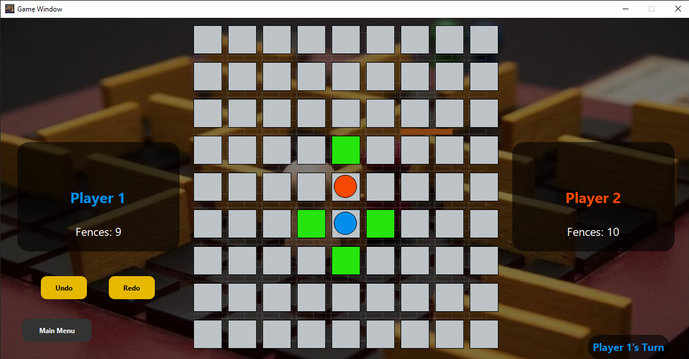
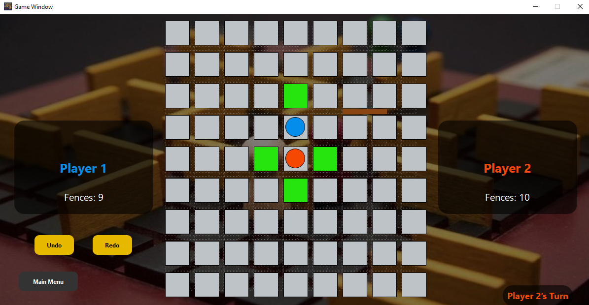
If there is a wall behind the other player
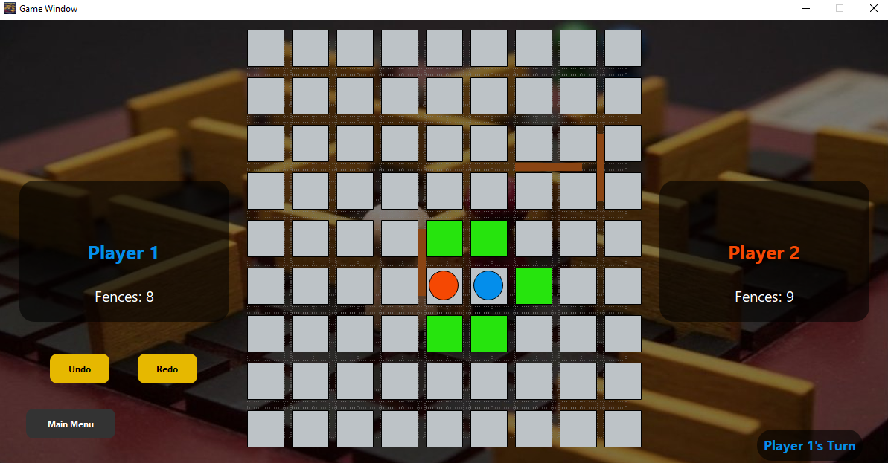
If there is a wall behind the other player and another one to the diagonal
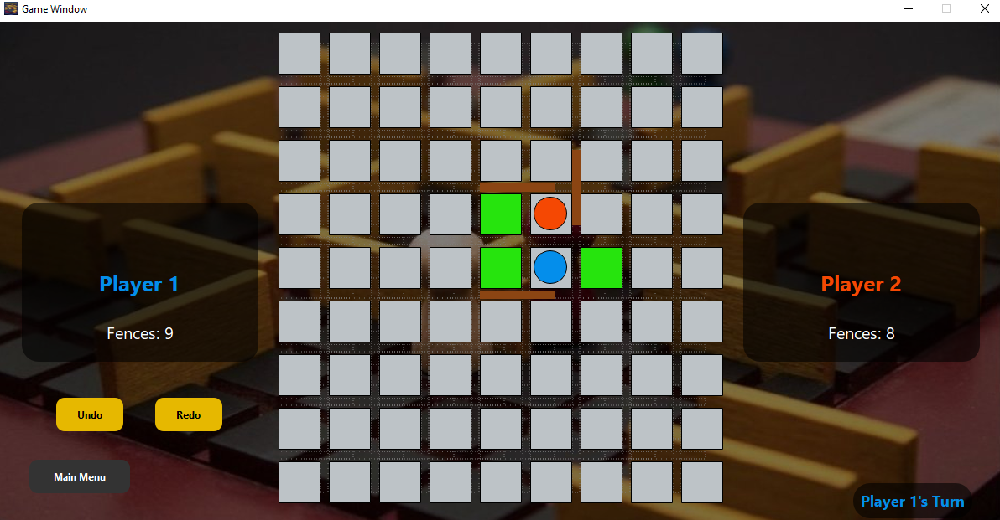
Player winning
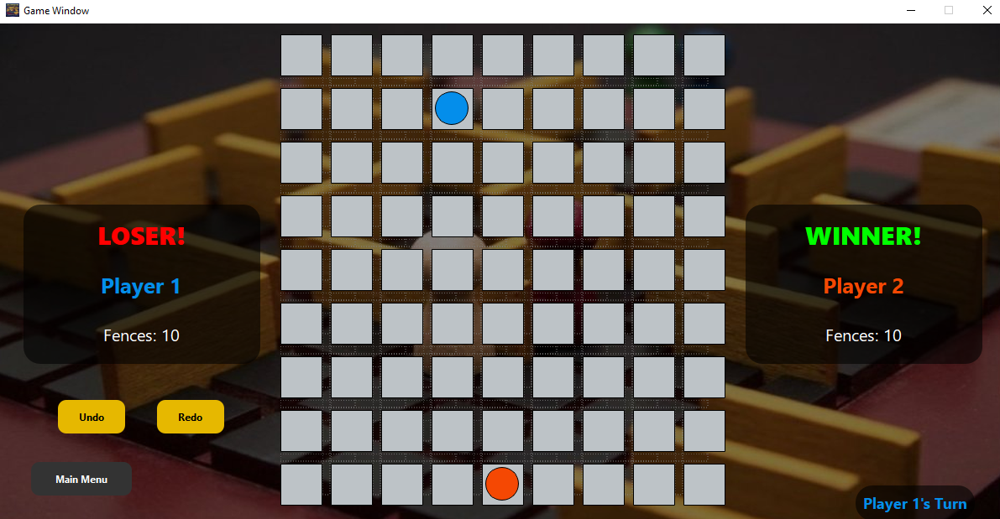
Before undo

After undo
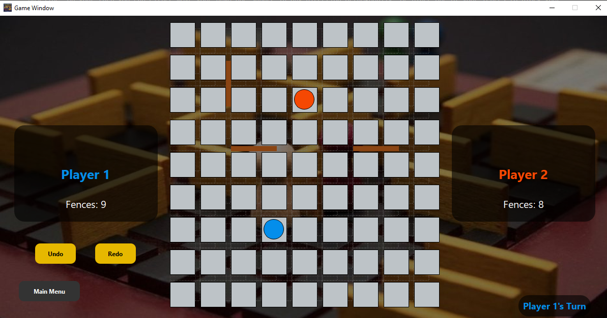
After Redo
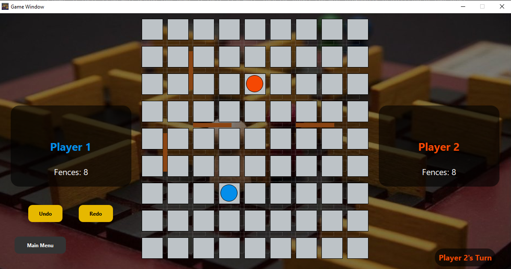
We can undo till the start of the game, and redo till the current move
The Main Menu button goes back to the mode choosing window and resets the modes

Preventing closing the baseline
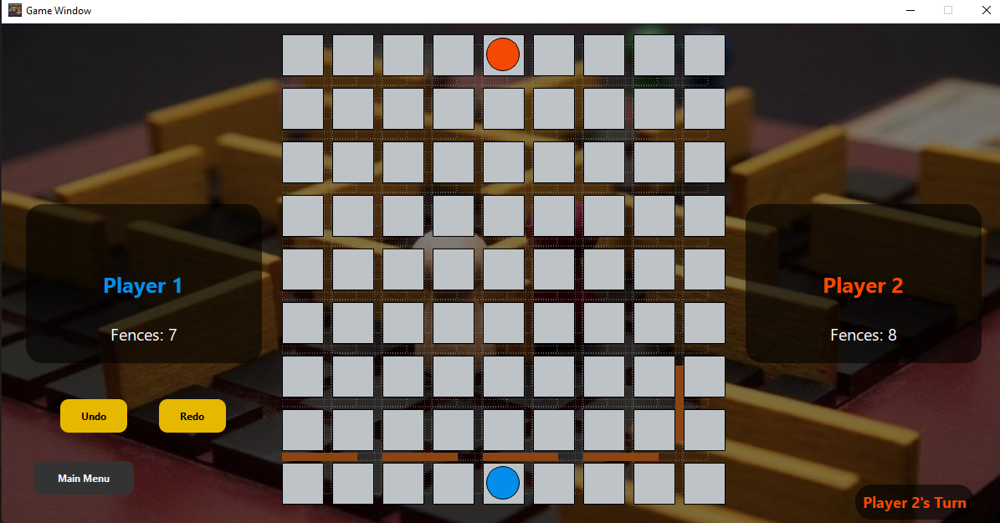
After trying to close:
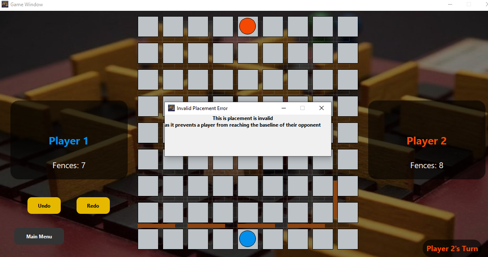

The AI Mode works by Breadth First Search, where if the minimum path for the player is less than for the AI, the AI starts placing fences and it places them in the places that maximize the minimum path for the player, if the AI fences are all used or the player's minimum path is greater than the AI's minimum path, the AI moves on its minimum path.
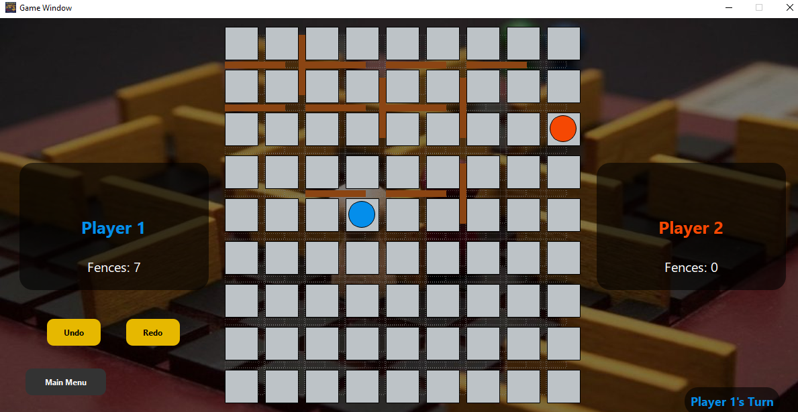

#Demo Video Link:
https://drive.google.com/file/d/1sMfCG7sMWwVy2OQ648BJl3oU3o1O3Tiy/view?usp=sharing
